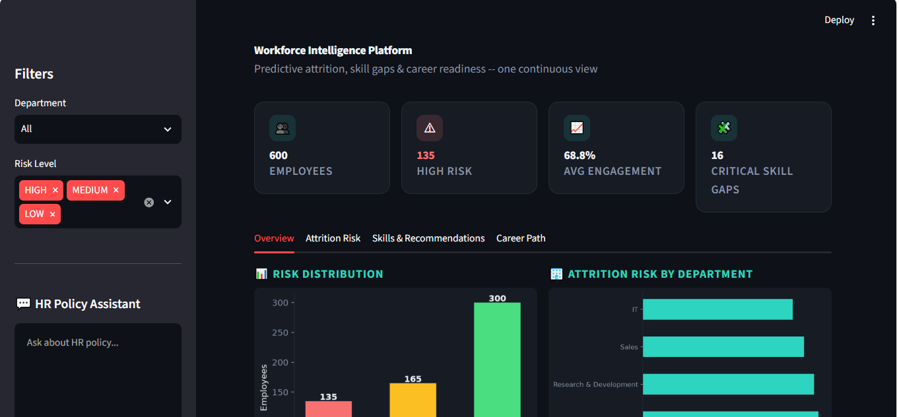
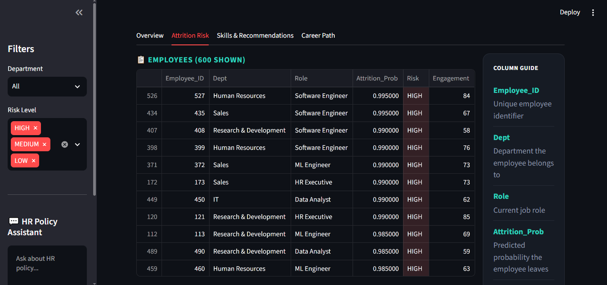
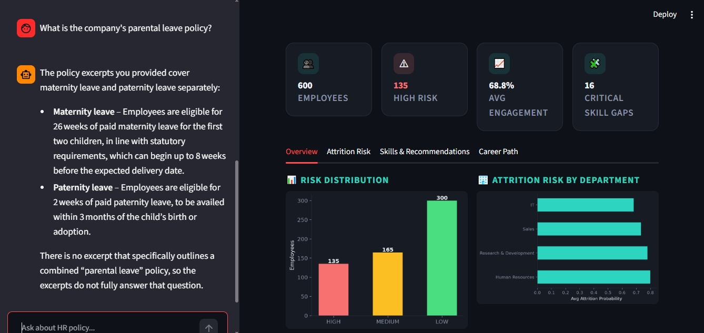
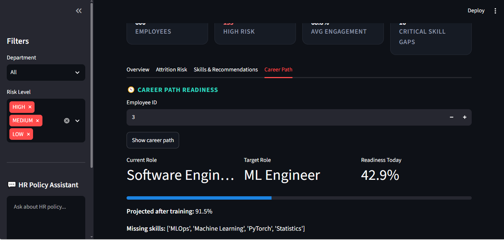

# Workforce Intelligence & Upskilling Platform

An end-to-end HR analytics system that predicts employee attrition, diagnoses skill gaps, and recommends upskilling — built from raw CSVs to a served FastAPI backend and Streamlit dashboard.

<!-- Optional badges — remove or edit as needed


-->

The project is organized as four sequential milestones. Each stage consumes the previous stage's saved output, so the pipeline runs start to finish without recomputation:

```
Day 1: Data Foundation  →  Day 2: Machine Learning  →  Day 3: Workforce Intelligence  →  Day 4: Application
   (clean, validated          (attrition model +           (engagement, skill gaps,        (FastAPI + tests +
    data + join map)           explainability)              recommendations)                Streamlit dashboard)
```

---

## Table of Contents

- [1. Problem & Solution](#1-problem--solution)
- [2. Data Sources](#2-data-sources)
- [3. Pipeline](#3-pipeline)
- [4. Project Structure](#4-project-structure)
- [5. Tech Stack](#5-tech-stack)
- [6. Setup & Installation](#6-setup--installation)
- [7. Running It](#7-running-it)
- [8. Screenshots](#8-screenshots)
- [9. Troubleshooting (Problem & Solution)](#9-troubleshooting-problem--solution)
- [10. Design Decisions Worth Noting](#10-design-decisions-worth-noting)
- [11. Limitations & Next Steps](#11-limitations--next-steps)

---

## 1. Problem & Solution

### The Problem

HR teams typically find out an employee is leaving only *after* they've resigned — by which point retention options are limited. On top of that, most organizations track skills informally (spreadsheets, manager memory), so nobody has a clear, org-wide view of:

- Which employees are quietly disengaging or at risk of leaving, and why
- Where the biggest skill gaps are, per employee and per role
- What each employee should learn next, and who needs it most urgently
- Answers to everyday HR policy questions (leave, notice period, etc.), without waiting on an HR rep

This reactive, fragmented approach means attrition risk and skill gaps are discovered too late to act on, and HR support doesn't scale as headcount grows.

### The Solution

This project builds a **proactive, end-to-end workforce intelligence system** that turns raw HR data into forward-looking, actionable answers:

| Problem | How this project solves it |
|---|---|
| Attrition is discovered too late | A **Random Forest model** (tuned for recall, so at-risk employees aren't missed) predicts attrition risk per employee *before* they resign, with **SHAP explainability** showing exactly why |
| No org-wide visibility into skill gaps | A **skill gap engine** compares each employee's held skills against what their role requires, ranked by severity across the whole organization |
| Upskilling is ad hoc / unguided | A **recommendation engine** (direct + semantic matching) suggests specific skills to learn next, prioritized by urgency |
| HR policy questions bottleneck on HR staff | An **HR Policy Q&A assistant** (TF-IDF retrieval + Groq LLM) answers employee questions instantly, grounded strictly in actual policy documents — reducing HR's repetitive-question load |
| Insights are scattered across notebooks/spreadsheets | Everything is unified into a single **Employee Intelligence Table**, served through a **FastAPI backend** and an interactive **Streamlit dashboard**, so risk, skills, and recommendations are all visible in one place |

In short: instead of reacting to resignations and guessing at skill gaps, HR gets a live, explainable, queryable system that flags risk early, points to specific fixes (upskilling), and answers routine policy questions automatically.

## 2. Data Sources

Five raw datasets, joined on `EmployeeID` and `JobRole ↔ RoleName`:

| File | Contents |
|---|---|
| `employee_attrition.csv` | Demographics, department, tenure, satisfaction, attrition label |
| `hr_performance_engagement.csv` | Manager ratings, performance ratings, engagement scores |
| `occupation_data.csv` | Role definitions and descriptions |
| `essential_skills.csv` | Skills required per occupation, with importance weights |
| `software_skills.csv` | Software/tool proficiencies required per occupation |

~600 employees across Sales, R&D, HR, and IT.

## 3. Pipeline

### Day 1 — Data Foundation
`notebooks/Day1_Data_Foundation.ipynb`

- **Understanding**: shape, dtypes, missing values, duplicates, and likely join keys profiled for all 5 tables.
- **Validation**: each file checked against explicit rules (e.g. Age 18–100, satisfaction/balance on a 1–4 scale, engagement 0–100) *before* any cleaning, so problems are documented, not silently fixed.
- **Cleaning**: missing values, inconsistent text, impossible values, and duplicates resolved per file, with a cleaning log.
- **Re-validation**: cleaned files re-run through the same validation rules to confirm the fixes actually worked.
- **Relationships**: the two riskiest joins (`JobRole ↔ RoleName`, `EmployeeID`) explicitly verified for coverage and cardinality before being relied on downstream. An entity diagram and `docs/data_relationships.md` are generated.

**Output:** cleaned CSVs in `data/processed/`.

### Day 2 — Machine Learning
`notebooks/Day2_Machine_Learning.ipynb`

- **Feature engineering**: 19 features (16 numeric, 3 categorical, 4 engineered), checked for target leakage before use.
- **Baseline**: Logistic Regression, ROC-AUC 0.854.
- **Model comparison**: Logistic Regression, Random Forest, and XGBoost trained on an identical split and preprocessing pipeline.

  | Model | Precision | Recall | F1 | ROC-AUC |
  |---|---|---|---|---|
  | Random Forest | 0.816 | **0.944** | 0.875 | 0.793 |
  | Logistic Regression | 0.865 | 0.933 | 0.897 | 0.854 |
  | XGBoost | 0.808 | 0.899 | 0.851 | 0.769 |

  **Winner: Random Forest**, selected on **Recall first, F1 as tie-breaker** — for attrition specifically, a missed at-risk employee (false negative) is more costly than a false alarm, so the model isn't picked on whichever metric happens to be highest.

- **Explainability**: SHAP global summary (company-wide drivers of attrition) and local waterfall plots (why one specific employee was flagged), plus a plain-text top-10 driver list for dashboards/reports.
- **Versioning**: manual `models/v{n}/` folders with a `metadata.json` per version (algorithm, metrics, row counts, training date) and a reload check that verifies the saved model reproduces identical predictions. Noted as a placeholder for MLflow once manual versioning stops scaling.

**Output:** `models/attrition_pipeline.joblib` + versioned copies in `models/v{n}/`.

> **Known limitation:** a secondary "performance trend" classifier (Improving/Stable/Declining) was also trialed and did **not** clear its majority-class baseline (35% accuracy vs. a 55.5% baseline). It's kept in the notebook as a documented negative result, not used downstream — the label (`ManagerRating − PerformanceRating` gap) likely needs a better-defined target or more signal before it's viable.

### Day 3 — Workforce Intelligence
`notebooks/Day3_Workforce_Intelligence.ipynb`

- **Engagement analytics**: department-level engagement, lowest-engagement employees flagged.
- **Role intelligence**: a role master table — one row per role with its full required-skill list and importance weights.
- **Skill gap engine**: per-employee gap between required and held skills, walked through for one employee, then ranked organization-wide by severity.
- **Upskilling recommendations**: v1 direct matching, v2 semantic matching against the skill taxonomy for better recall on near-miss skill names.
- **Employee Intelligence Table**: the single output table joining attrition risk, engagement, skill gaps, and recommendations per employee, sorted by priority.

**Output:** `data/processed/employee_intelligence.csv` — the table every Day 4 endpoint serves from.

### Day 4 — Application
`notebooks/Day4_Application.ipynb`

- **Refactor**: notebook logic moved into a real `app/` package — `config.py`, `logger.py`, `prediction_logger.py`, `model_loader.py`, `predictor.py`, `employee_schema.py`, service modules, and API routes (21 files total). Verified the refactor didn't change any results.
- **HR Policy Q&A**: TF-IDF retrieval over a curated local policy dataset (`data/policy_qa.jsonl`), with Groq (via plain HTTP) generating grounded answers from the top-matching policy excerpts.
- **FastAPI backend** — 6 endpoints:

  | Method | Endpoint | Purpose |
  |---|---|---|
  | `GET` | `/dashboard/summary` | Headline KPIs |
  | `GET` | `/dashboard/attrition-by-department` | Department-level attrition breakdown |
  | `GET` | `/dashboard/skill-gaps` | Organization-wide skill gap view |
  | `GET` | `/dashboard/recommendations` | Ranked upskilling recommendations |
  | `GET` | `/employees/{employee_id}` | Full intelligence record for one employee |
  | `POST` | `/predict/attrition` | Live attrition prediction on a new employee record |

- **Input validation**: Pydantic schema on `/predict/attrition` — missing fields, out-of-range values, and invalid categories all rejected with `422` before reaching the model.
- **Logging**: application lifecycle logged to `logs/app.log`; every prediction served is logged to `data/predictions/prediction_log.csv` for traceability.
- **Testing**: `pytest` suite (11 tests) covering validation, prediction bounds, risk buckets, and status codes — passing.
- **Dashboard**: `frontend/dashboard.py`, a Streamlit app over the same intelligence table and API.

**Output:** a runnable service — `app/` (API), `tests/` (suite), `frontend/dashboard.py` (UI).

## 4. Project Structure

```
├── data/
│   ├── raw/                     # 5 original CSVs, untouched
│   ├── processed/                # cleaned + engineered outputs
│   ├── predictions/              # logged live predictions
│   └── policy_qa.jsonl           # curated HR policy Q&A dataset
├── docs/
│   └── data_relationships.md     # generated entity/join documentation
├── models/
│   ├── attrition_pipeline.joblib # current production pipeline (preprocessing + model)
│   └── v1/, v2/, v3/...          # versioned pipeline + metadata.json
├── app/
│   ├── utils/                    # config, logger, prediction_logger
│   ├── ml/                       # model_loader, predictor
│   ├── validation/               # employee_schema (Pydantic)
│   ├── services/                 # business logic per domain (incl. policy_service.py)
│   └── main.py                   # FastAPI app + routes
├── frontend/
│   └── dashboard.py               # Streamlit dashboard
├── tests/
│   └── test_api.py                # pytest suite
├── notebooks/
│   ├── Day1_Data_Foundation.ipynb
│   ├── Day2_Machine_Learning.ipynb
│   ├── Day3_Workforce_Intelligence.ipynb
│   └── Day4_Application.ipynb
├── logs/
│   └── app.log
├── .env.example                  # template for required environment variables
└── requirements.txt
```

## 5. Tech Stack

| Layer | Tools |
|---|---|
| Data | pandas, numpy |
| Modeling | scikit-learn, XGBoost |
| Explainability | SHAP |
| Retrieval | scikit-learn TF-IDF (HR Policy Q&A) |
| LLM | Groq API (`openai/gpt-oss-20b`) |
| API | FastAPI, Pydantic |
| Testing | pytest |
| Dashboard | Streamlit |
| Serialization | joblib |

## 6. Setup & Installation

### Prerequisites

- Python 3.10+
- A [Groq API key](https://console.groq.com/keys) (free tier available) for the HR Policy Q&A feature

### Steps

```bash
# 1. Clone the repository
git clone https://github.com/aanaGoyal/Hr_Agentic_Project.git
cd Hr_Agentic_Project

# 2. Create and activate a virtual environment
python -m venv .venv

# On Windows:
.venv\Scripts\activate

# On macOS/Linux:
source .venv/bin/activate

# 3. Install dependencies
pip install -r requirements.txt

# 4. Configure environment variables
# Copy the example file and fill in your real key
copy .env.example .env        # Windows
# cp .env.example .env        # macOS/Linux
```

Then open `.env` and add your key:

```
GROQ_API_KEY=your_actual_groq_api_key_here
```

> ⚠️ `.env` is git-ignored and should **never** be committed. Only `.env.example` (with a placeholder value) belongs in version control.

## 7. Running It

```bash
# Run the notebooks in order (Day 1 → Day 4) to regenerate data/models,
# or use the pre-generated artifacts already in data/ and models/

# Run the API (from the project root)
uvicorn app.main:app --reload
# → API docs available at http://127.0.0.1:8000/docs

# Run the dashboard (in a separate terminal, from the project root)
streamlit run frontend/dashboard.py
# → opens automatically at http://localhost:8501

# Run the test suite
pytest tests/
```

## 8. Screenshots

> Screenshots live in `docs/screenshots/` in this repo. If you're viewing this on GitHub, make sure the image files below are committed at those exact paths.

### Dashboard Overview


### Attrition Risk Prediction


### HR Policy Q&A


### Career Path / Upskilling Recommendations


## 9. Troubleshooting (Problem & Solution)

Real issues encountered while setting up this project, documented so future contributors (or future you) don't have to re-debug them.

### Problem: `git push` rejected — "Push cannot contain secrets"
GitHub's push protection blocked a push because a real Groq API key was committed in files like `.env.example` and `policy_service.py`.

**Solution:** Revoke the exposed key immediately at [console.groq.com](https://console.groq.com/keys). Then remove the secret from git **history** (not just the current files) using `git filter-repo --replace-text`, or — for early-stage repos with no other collaborators — wipe and reinitialize `.git` entirely. Keep real secrets only in a git-ignored `.env` file, never in tracked files.

### Problem: `NameError: name 'GROQ_API_KEY' is not defined`
The code loaded the key into a variable named `api_key`, but referenced `GROQ_API_KEY` (undefined) later in the request headers.

**Solution:** Use the same variable name consistently:
```python
api_key = os.getenv("GROQ_API_KEY")
headers = {"Authorization": f"Bearer {api_key}", "Content-Type": "application/json"}
```

### Problem: `HTTPError: 401 Client Error: Unauthorized`
The Groq API rejected requests even after the `NameError` was fixed.

**Solution:** Caused by either (a) `.env` not being found, so `api_key` was `None`, or (b) an old/revoked key still sitting in `.env`. Confirmed by temporarily printing `api_key[:10]`. Fixed by generating a fresh key at Groq and pointing `load_dotenv()` to the correct path:
```python
from pathlib import Path
from dotenv import load_dotenv

env_path = Path(__file__).resolve().parents[2] / ".env"
load_dotenv(dotenv_path=env_path)
```

### Problem: Worked in Jupyter notebook, still failed in Streamlit
Same `NameError`/401 errors kept reappearing in the Streamlit dashboard even after the notebook ran successfully.

**Solution:** Two separate causes:
1. A notebook cell was **regenerating `policy_service.py` from a hardcoded string** on every run, silently overwriting manual fixes made directly in the file. Fixed the bug at the source (inside the string in the notebook cell), then re-ran the cell.
2. Streamlit was still running an old process from before the fix. Stopped it fully (`Ctrl+C`), cleared Streamlit's cache, and restarted from the project root (`streamlit run frontend\dashboard.py`) so it picked up the corrected code and `.env`.

### Problem: `.env` not found by `load_dotenv()`
`load_dotenv()` with no arguments only searches the current working directory, which differs depending on whether you launch from a notebook, `cmd`, or Streamlit.

**Solution:** Don't rely on the default lookup — resolve the path explicitly relative to the file itself (see snippet above), and verify with `env_path.exists()` before debugging further downstream.

### Problem: `Remove-Item` / `rmdir` not recognized
PowerShell-only commands (`Remove-Item`) were run inside Command Prompt (`cmd.exe`), which doesn't recognize them.

**Solution:** Either use the `cmd`-native equivalent (`rmdir /s /q .git`), or switch to PowerShell first by typing `powershell` in the existing terminal.

## 10. Design Decisions Worth Noting

- **Recall over accuracy for attrition**: intentional trade-off, documented in Day 2 — the cost of missing a real leaver outweighs the cost of a false positive.
- **Full pipelines saved, not bare models**: `attrition_pipeline.joblib` bundles preprocessing + model, so any caller can pass a raw record without re-implementing encoding/scaling.
- **Manual versioning before MLflow**: kept deliberately simple for the MVP stage; each `models/v{n}/` folder is self-describing via `metadata.json`, with MLflow flagged as the natural next step once training more variants by hand becomes a bottleneck.
- **Validation before modeling**: rules defined in Day 1 (age ranges, rating scales) are reused verbatim in the Day 4 API schema, so what counts as "valid data" is defined once and enforced consistently end to end.
- **Grounded policy answers**: the HR Policy Q&A feature retrieves the top matching policy excerpts via TF-IDF before calling the LLM, and explicitly instructs it to answer only from those excerpts (and flag conflicts) — reducing hallucinated policy claims.

## 11. Limitations & Next Steps

- Dataset is ~600 employees (synthetic-scale) — fine for an MVP/demo, thin for production-grade confidence intervals.
- The performance-trend classifier (Day 2, bonus) underperforms its baseline and should be dropped or revisited with a better-defined label before any use.
- Manual model versioning should migrate to MLflow (or similar) once iteration speed increases.
- HR Policy Q&A currently answers from a fixed, curated dataset — expanding coverage would require adding more Q&A pairs to `data/policy_qa.jsonl`.
